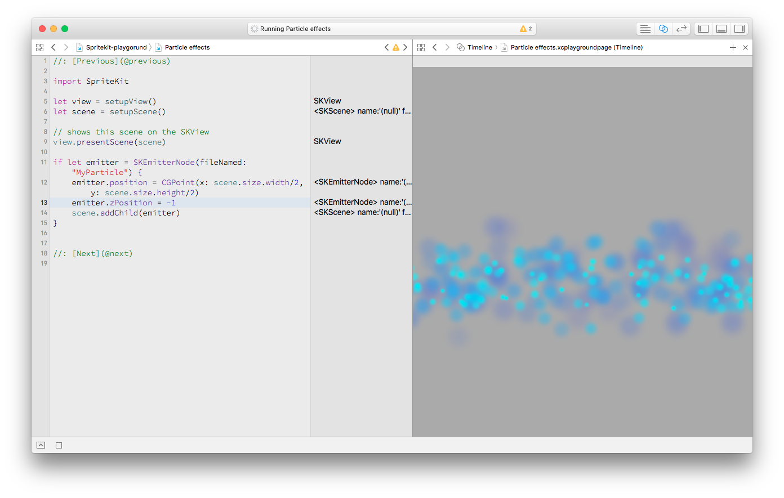

# SpriteKit Playground



Xcode Playground with some sample SpriteKit code. The *best part is that you can preview from this Playground what's happening to your SKScene*.

So what's included?

- how to create a Scene
- how to show a SKView inside the Playground
- Printing SKViews, text
- Particle effects
- Game loop
- Physics bodies

## How this works? I mean, how you show the results of SpriteKit without running the app in the Simulator?

### Xcode 8

- In a playground you can `import PlaygroundSupport`
- Once you've imported XCPlayground, just do:

```swift
PlaygroundPage.current.liveView = view
```

and pass in the view you want to view in your Playground.

- Last, but not least, click on the Assistant Editor button (the one with two rings) and select `Timeline`

### For good ol' Xcode 7

- In a playground you can `import XCPlayground`. [This package](https://developer.apple.com/library/ios/documentation/Miscellaneous/Reference/XCPlaygroundModuleRef/XCPlayground.html) provides some utilities to interact with the Playground itself. It's a *utilities* module to pimp up your Playgrounds.

- Once you've imported XCPlayground, just do:

```swift
XCPlaygroundPage.currentPage.liveView = view
```

and pass in the view you want to view in your Playground.

- Last, but not least, click on the Assistant Editor button (the one with two rings) and select `Timeline`